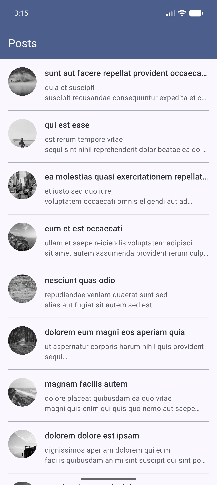
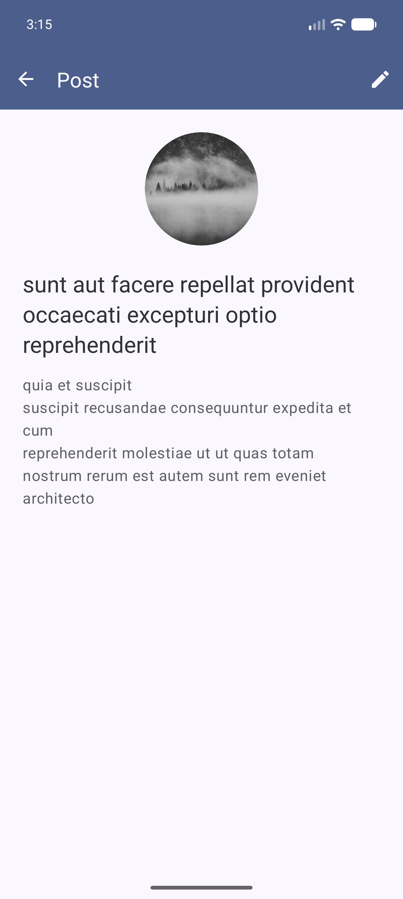
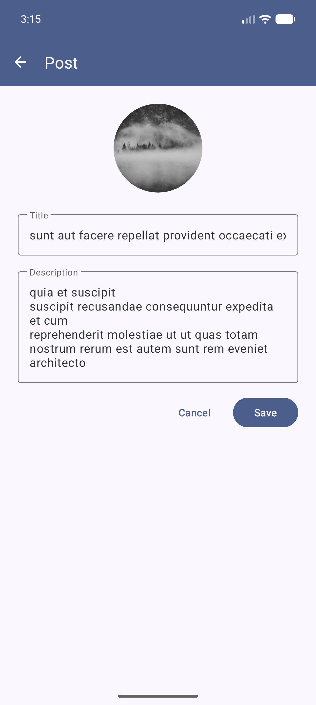

# Ngaming Case

[English](#english) [Türkçe](#türkçe) 

<p>
  
  
  
</p>

## English

A multi-module list and edit app written with MVVM and clean architecture.

Posts come from the [jsonplaceholder](https://jsonplaceholder.typicode.com/posts) API. Swipe a row to delete it, deleted rows can be brought back. Tap a row to open the detail screen. The pencil icon there makes the title and description editable.

### Libraries

* [Kotlin](https://kotlinlang.org/)
* [Coroutines & Flow](https://kotlinlang.org/docs/coroutines-overview.html) - async work and data streams
* Architecture Components
  * [ViewModel](https://developer.android.com/topic/libraries/architecture/viewmodel) - screen data, survives rotation
  * [StateFlow](https://developer.android.com/kotlin/flow/stateflow-and-sharedflow) - holds the screen state
  * [ViewBinding](https://developer.android.com/topic/libraries/view-binding) - instead of findViewById
  * [Navigation Component](https://developer.android.com/guide/navigation) - moving between screens
  * [SavedStateHandle](https://developer.android.com/topic/libraries/architecture/viewmodel/viewmodel-savedstate) - carries the post id into the detail screen
* Dependency Injection
  * [Hilt](https://dagger.dev/hilt/) - no manual wiring
* Architecture
  * MVVM
  * Clean architecture over multiple modules
  * Repository pattern
* [Retrofit](https://github.com/square/retrofit) - API calls
* [kotlinx.serialization](https://github.com/Kotlin/kotlinx.serialization) - JSON parsing
* [OkHttp](https://github.com/square/okhttp) - request logging
* [Glide](https://github.com/bumptech/glide) - image loading
* [Material 3](https://m3.material.io/) - theme and components, dark theme included
* [RecyclerView & DiffUtil](https://developer.android.com/develop/ui/views/layout/recyclerview) - the list, only changed rows are redrawn
* Testing
  * [JUnit4](https://junit.org/junit4/)
  * [MockK](https://mockk.io/) - mocking
  * [coroutines-test](https://kotlinlang.org/api/kotlinx.coroutines/kotlinx-coroutines-test/) - coroutine and Flow tests

### Modules

```
:app                        entry point, navigation host
:core:common                AppResult / AppError
:core:network               Retrofit, OkHttp, safe call wrapper
:core:ui                    BaseActivity / BaseFragment, extensions, theme
:feature:posts:domain       model, repository contract, use cases
:feature:posts:data         DTOs, PostApi, PostRepositoryImpl
:feature:posts:ui           fragments, adapter, view models
```

Dependencies point one way. `ui` and `data` never see each other, both depend on `domain`. Shared Gradle setup lives under `buildSrc/`.

### Build

```bash
./gradlew :app:assembleDebug
./gradlew test testDebugUnitTest
```

The app opens in Turkish when the device language is Turkish.

---

## Türkçe

MVVM ve clean architecture ile yazılmış, çok modüllü bir listeleme ve düzenleme uygulaması.

Gönderiler [jsonplaceholder](https://jsonplaceholder.typicode.com/posts) API'sinden geliyor. Satırı kaydırınca siliniyor. Satıra dokununca detay ekranı açılıyor. Detay ekranında kalem ikonuna basınca başlık ve açıklama düzenleniyor.

### Kullanılan kütüphaneler

* [Kotlin](https://kotlinlang.org/)
* [Coroutines & Flow](https://kotlinlang.org/docs/coroutines-overview.html) - asenkron işler ve veri akışı
* Architecture Components
  * [ViewModel](https://developer.android.com/topic/libraries/architecture/viewmodel) - ekran verisi, ekran dönünce kaybolmuyor
  * [StateFlow](https://developer.android.com/kotlin/flow/stateflow-and-sharedflow) - ekranın durumunu tutuyor
  * [ViewBinding](https://developer.android.com/topic/libraries/view-binding) - findViewById yerine
  * [Navigation Component](https://developer.android.com/guide/navigation) - ekran geçişleri
  * [SavedStateHandle](https://developer.android.com/topic/libraries/architecture/viewmodel/viewmodel-savedstate) - detay ekranına gönderi id'si taşıyor
* Dependency Injection
  * [Hilt](https://dagger.dev/hilt/) - bağımlılıkların yönetimi
* Mimari
  * MVVM
  * Clean architecture, çok modüllü yapı
  * Repository pattern
* [Retrofit](https://github.com/square/retrofit) - API istekleri
* [kotlinx.serialization](https://github.com/Kotlin/kotlinx.serialization) - JSON çevirme
* [OkHttp](https://github.com/square/okhttp) - istek loglama
* [Glide](https://github.com/bumptech/glide) - görsel yükleme
* [Material 3](https://m3.material.io/) - tema ve hazır bileşenler, koyu tema dahil
* [RecyclerView & DiffUtil](https://developer.android.com/develop/ui/views/layout/recyclerview) - liste, sadece değişen satır güncelleniyor
* Test
  * [JUnit4](https://junit.org/junit4/)
  * [MockK](https://mockk.io/) - mock
  * [coroutines-test](https://kotlinlang.org/api/kotlinx.coroutines/kotlinx-coroutines-test/) - coroutine ve Flow testleri

### Modüller

```
:app                        giriş noktası, navigation host
:core:common                AppResult / AppError
:core:network               Retrofit, OkHttp, çağrı sarmalayıcısı
:core:ui                    BaseActivity / BaseFragment, extension'lar, tema
:feature:posts:domain       model, repository sözleşmesi, use case'ler
:feature:posts:data         DTO, PostApi, PostRepositoryImpl
:feature:posts:ui           fragment'lar, adapter, view model'ler
```

Bağımlılıklar tek yöne bakıyor. `ui` ile `data` birbirini görmüyor, ikisi de `domain`'e bağlı. Ortak Gradle ayarları `buildSrc/` altında duruyor.

### Çalıştırmak

```bash
./gradlew :app:assembleDebug
./gradlew test testDebugUnitTest
```

Cihaz dili Türkçe ise uygulama Türkçe açılıyor.

